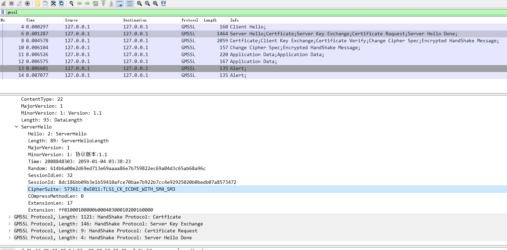

# gmssl_wireshark
Wireshark Lua dissector script for gmssl protocol.国密SSL的wireshark解析脚本,Lua实现

Any types May not implemented. We are constantly updating the dissector. Include the code-style, gmssl protocol, and so on.

# Preview

# How to use it?
## 1st. step
   Put the **GMSSL.lua** in the wireshark Install directory.  Which contains **init.lua**
## 2ed. step
   Update the **init.lua** file,  In the End line of file. Add the next:

   **dofile(DATA_DIR.."GMSSL.lua")**
## 3rd. step
   If wireshark is running. Restart it.

# 使用方式
## 第一步
  将 **GMSSL.lua** 文件放入 wireshark 的安装目录，在该目录里面会存在 **init.lua** 文件
## 第二步
  更新 **init.lua** 文件，的文件的末尾添加如下一行:

  **dofile(DATA_DIR.."GMSSL.lua")**
## 第三步
  如果 Wireshark 正在运行，重启, Wireshark即可自动解析 GMSSL 的协议

  